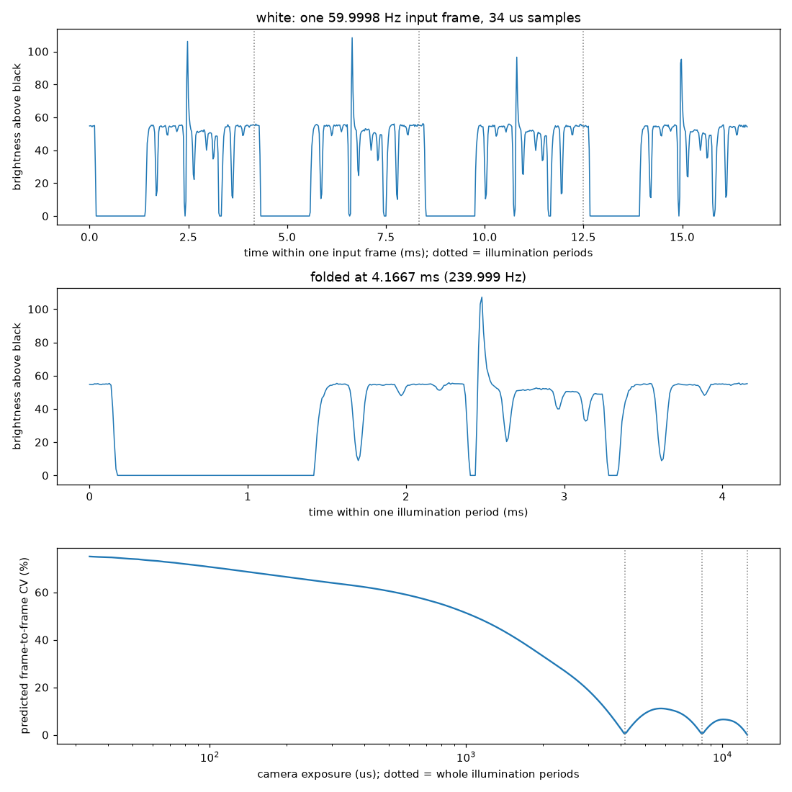
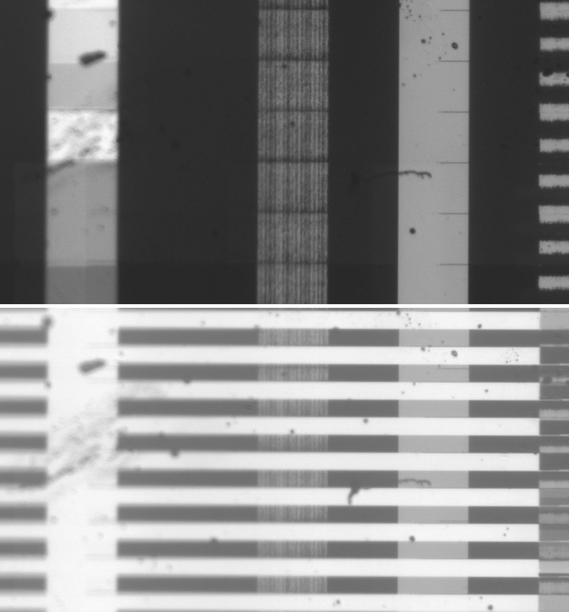
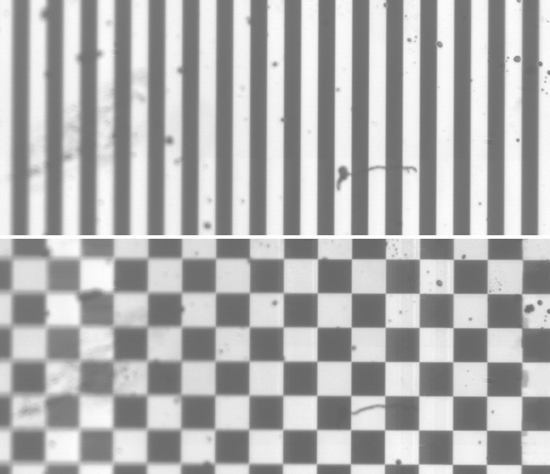

# projector — TI DLP471TPEVM

The projector is a TI **DLP471TPEVM**. The GUI's EVM Selection confirms it,
and it enumerates on USB as a DLPC7540 controller. It drives a 0.47" DLP471TP
4K UHD DMD and takes a 3840×2160 input.

The mirror-column numbers in this README assume a 1920×1080 mirror array with
XPR pixel shifting, where 2 input px correspond to about 1 mirror in each
axis. That hasn't been checked against the DLP471TP datasheet. The input-pixel
numbers are measured and don't depend on it.

It has two connections to the PC:

| link | shows up as | used for |
| --- | --- | --- |
| HDMI | monitor `Generic Monitor (DLP PICO 4K)`, `\\.\DISPLAY5`, 3840×2160, 150 % scaling, extended to the right of the primary display | the image |
| USB | `USB\VID_0451&PID_7540` composite device with a **Projector Control** interface | TI's DLP EVM GUI (control only, no image data) |

The scripts here draw on the projector as an ordinary Windows display: a
full-screen OpenCV window on the projector's monitor. They watch the result
with the Basler camera, using [`camera/`](../camera/README.md).

All commands run from the repo root. **Close the live viewer
(`camera\run.ps1`) and pylon Viewer first.** The camera allows only one
client at a time.

## Scripts

| script | what it does |
| --- | --- |
| `display.py` | finds the projector monitor, generates test patterns, and shows them full-screen (library) |
| `capture.py` | opens the camera and returns a flicker-free median of the lit frames (library) |
| `dmd_calibrate.py` | maps camera px to projector input px and stores a white reference in `captures/calib.npz` |
| `dmd_blocks.py` | alternates black / horizontal stripes, scores every column and lists the faulty column ranges |
| `dmd_probe.py` | shows any list of patterns and saves what the camera sees, plus a contact sheet |
| `flicker.py` | `waveform`: the illumination over time (camera at 920 fps, 34 µs) and the flicker it predicts for any exposure; `sweep`: measured flicker against camera fps and exposure |
| `hdmi.ps1` | logs monitor plug/unplug events to `C:\hdmi-log.csv` (watches for HDMI dropouts) |

Outputs go to `projector/captures/<timestamp>_<tag>/`, which is git-ignored.

```powershell
# 1. calibrate (again whenever the camera or projector moves, or exposure changes)
.\.venv\Scripts\python.exe projector\dmd_calibrate.py

# 2. find bad DMD columns (about 25 s for 8 repeats; --repeats 30 for a longer watch)
.\.venv\Scripts\python.exe projector\dmd_blocks.py

# look at arbitrary patterns
.\.venv\Scripts\python.exe projector\dmd_probe.py black white hbars64 vbars64 checker128 grid
```

Patterns (`display.PATTERN_HELP`): `black`, `white`, `grayN`, `grid`
(labelled, lines every 240 px), `vbarsN` / `hbarsN` (N-px alternating
columns / rows), `checkerN`, `hramp`, `vramp`, `marker`.

### How the measurement works

- **Flicker.** At 100 µs exposure, only about a quarter of the frames catch the
  illumination; the rest are black. `capture.lit_median` keeps the frames whose
  mean is at least half that of the brightest one, and takes the per-pixel
  median of those.
- **Exposure.** 100 µs is the default. At 1000 µs, white and gray128 saturate
  and the faulty bands clip to 255.
- **Calibration.** Edges of 64 px bars give the scale in each axis. Because
  the bars repeat, that leaves the offset ambiguous by one bar period. A single
  256 px `marker` square resolves it. Black is subtracted before searching for
  the marker, because stuck-on bands would otherwise look like marker pixels.
  The x axis ignores the stray-light surround, which carries faint ghost copies
  of the bars. Measured mapping (2026-09-25):
  `cam_x = 0.4517·x + 325`, `cam_y = 0.457·y − 146`. The camera sees input
  x 0–3564 and y 318–2160, so the right ~280 px and the top ~320 px are out of view.
- **Scoring.** `dmd_blocks` computes two numbers per camera column:
  - the black level: black ÷ white
  - the stripe contrast: amplitude of the stripe-frequency component, which
    doesn't depend on the stripe phase, so the slight camera rotation doesn't matter

  A column is flagged when either number is far off the median of its
  neighbourhood within ±512 px. The healthy level drifts across the image
  (stripe contrast ≈ 0.2 on the left, ≈ 0.4 on the right), so a single global
  median would flag the edges.

## Debugging log

### 2026-09-25 — why the camera sees flicker: 240 Hz illumination with a dark gap — EXPLAINED

**Method.** `flicker.py waveform` shrinks the camera to a 1024×16 AOI, which
runs at 920 fps with a 34 µs exposure, and records white for 6.5 s. It then
folds the samples by their hardware timestamps at multiples of the 60 Hz
refresh rate.

**Result.** The fold at **239.9988 Hz** explains 96.3 % of the brightness
variance, so the light repeats four times per 59.9998 Hz input frame. Folding
at 180 or 360 Hz only reaches 68 %. An unconstrained search was fooled by
aliasing: the camera samples at an exactly even rate, and on 0.5 s of data
320 Hz folded almost as well (90.8 %) as 240 Hz (91.3 %). So the script
searches only multiples of the refresh rate.

Each 4.167 ms period starts with a **1.25 ms dark gap**. The light is above 10 %
of peak for only 66 % of the time, with a few shorter dips and one bright
spike about 2.5 ms in. What causes the gap hasn't been identified. Possible
causes are XPR actuator settling, or a colour segment whose LED is off;
comparing with one LED at a time in the GUI would tell.



The effect on the camera, the frame-rate sweep, and the fix (whole-period
exposure) are written up in
[camera/README.md](../camera/README.md#why-the-camera-sees-flicker-measured-2026-09-25).

**Side findings.**
- Grays up to at least 32/255 are displayed as black: black, gray4 and gray32
  all read about 28 at 100 µs.
- Black's level (stray light plus the stuck-on bands) is high enough that
  every exposure over about 1 ms saturates the camera. The light needs to come
  down about 10× before whole-period exposures can be used.

### 2026-09-25 — no light; LEDs off and won't enable; GUI shows "Ready; Curtain" — FIXED

**Resolution.** A loose LED wire. Once it was reconnected, the light came back,
and the waveform measurement above was made after the fix. The controller
had been refusing LED enables because it couldn't drive the LEDs.

**Symptom.** Light was visible earlier in the day; by about 20:24 there was
none, by eye or on camera. Neither "Switch to External Video" nor the
built-in test patterns in the DLP EVM GUI 3.2.0.7 change anything.

**Measured** with `dmd_probe.py white black`:

| exposure | white | black | meaning |
| --- | --- | --- | --- |
| 100 µs, 0 dB | 0.0 | 0.0 | earlier today, white read ~155 here |
| 20 ms, +12 dB | 149.1 | 149.3 | room light only; the projector adds nothing |

**Checked.**
- HDMI is enumerated (`Generic Monitor (DLP PICO 4K)`).
- USB `VID_0451&PID_7540` is OK, and the GUI talks to the controller.
- EVM Selection is DLP471TPEVM, which is correct. The TEEVM name used
  earlier in this README was wrong.
- The GUI search finds no "curtain" setting.
- LED Current → **Get** reads all three LEDs as **disabled**. Enabling them
  with **Set** doesn't take effect: Get still reads them as disabled
  afterwards.
- The GUI's debug log (`Documents\USB2ANY\Logs`) only covers the USB2ANY I2C
  adapter, which isn't used, so it's no help. The GUI's command definitions
  are encrypted.

**Interpretation.** The controller is up and accepts commands, but it's
holding the illumination off and the image behind the curtain. It also
refuses LED enables, which suggests firmware protection rather than a missed
setting. The usual reasons for that are:
1. **DMD not detected, or the DMD interface failing to start.** This fits the
   earlier finding (entry below) of corrupted data reaching four DMD blocks.
   It would mean the same controller-to-DMD connection has got worse, or has
   been disturbed by handling or a reseat.
2. **An illumination fault**: the LED driver, LED supply, or temperature
   (fan) latching the LEDs off.
3. **A stuck controller state** that a full power cycle clears.

**Next steps.**
1. Fully power-cycle the EVM: unplug the power supply for at least 10 s, not
   just USB.
2. If there's still no light, check the GUI's **Information** and **Debug**
   pages for system status, DMD status, or error and fault flags.
3. Look at the board's status LEDs, and check whether the fan spins.
4. With power off: check that the DMD flex connectors are fully latched at
   both ends and the right way round, and that the DMD clamp is even.
5. Measure again with `dmd_probe.py white black` to confirm.

### 2026-09-25 — vertical stripes on the projected image — OPEN

**Symptom.** With the Windows desktop on the projector, the camera sees four
bright vertical bands on the right half of the image. The projector had also
seemed to vanish from USB. That turned out to be because it was switched off:
once it was powered, `VID_0451&PID_7540` enumerated normally. A cable swap
the same day is the only known physical change.

**Result.** The four bands sit at fixed positions and are one 128-mirror block
wide each. Block edges fall at mirror column 64 + 128·k. From
`dmd_blocks.py`, the same in all 6 repeats and in a 60 s watch:

| band | input px | DMD mirror cols | on black (should be off) | on 64-px horizontal stripes |
| --- | --- | --- | --- | --- |
| A | 1664–1920 | 832–960 | patchy blocks, one showing **stale image content** (desktop wallpaper) | solid white, stripes gone |
| B | 2432–2688 | 1216–1344 | fine random vertical-line noise | stripes visible under noise |
| C | 2944–3200 | 1472–1600 | solid white (stuck on) | stripes washed out |
| D | 3456–(3712) | 1728–(1856) | regular horizontal blocks | garbled; right edge out of camera view |

Per-block scores, where 100 = white level. A healthy block reads about 10 on
black; on stripes it reads 20–40, rising from left to right across the image.

```
block start x   1408  1664  1920  2176  2432  2688  2944  3200  3456
black             10    51    10    10    19     9    32     9    17
stripe contrast   33     1    37    39    32*   41    21    41     6
```
\* averaged over the block; the column-level flags mark 2435–2661 bad in
every repeat.



*Top: black. Bottom: 64-px horizontal stripes. Camera x 1000–1936.*

**Content dependence.** White, 64-px **vertical** bars and a 128-px
checkerboard come out essentially clean, even inside the bands:



[All patterns side by side](docs/2026-09-25_pattern_sheet.jpg).

**Interpretation.** This is not dead or stuck mirrors:

- Every mirror in the bands switches correctly when shown vertical bars.
- The errors depend on the content, form exact 128-column rectangles over the
  full height, and in one band show image data that was never sent. That
  points to mirrors not being loaded or reset.

This points to the **data or control path from the DLPC7540 to the DMD**. The
likely candidates are the flex cable and its connectors, or the DMD seating in
its socket or clamp; moving the board around during the cable swap could have
disturbed either. USB carries only control commands, so the USB cable can't
cause this. The errors are also aligned to DMD blocks, not to the input image,
which argues against an HDMI or source problem.

**Next steps.**
1. Power off completely and take ESD precautions. Reseat the controller-to-DMD
   flex at both ends, and check the DMD sits evenly in its clamp.
2. In the DLP EVM GUI, show the controller's **internal test patterns** (solid
   black, checkerboard). These bypass HDMI, so bands there confirm the fault is
   between the controller and the DMD.
3. Rerun `dmd_calibrate.py` and `dmd_blocks.py` and compare with the table above.
4. If the fault persists, ask on TI E2E: the DMD I/O or the controller may be
   damaged.

No baseline from before 2026-09-25 exists, so it is not proven that the fault
started with the cable swap.
